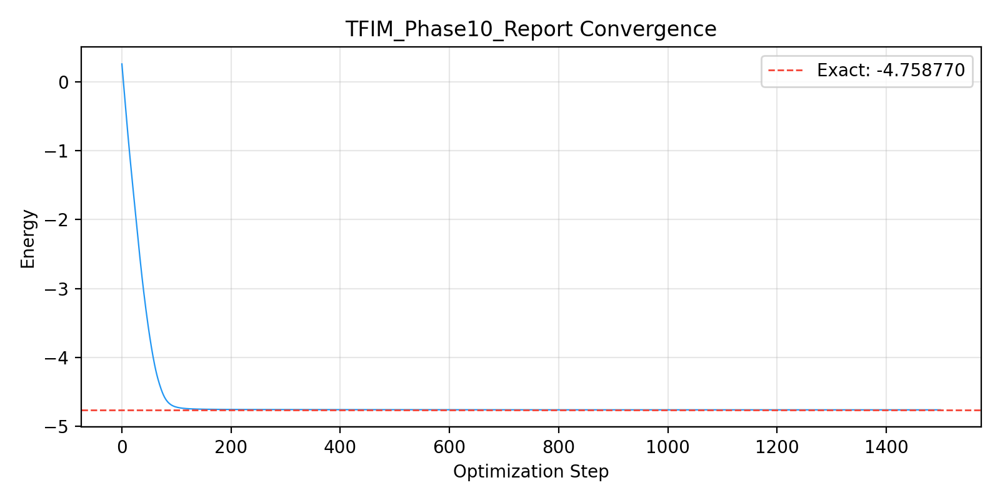
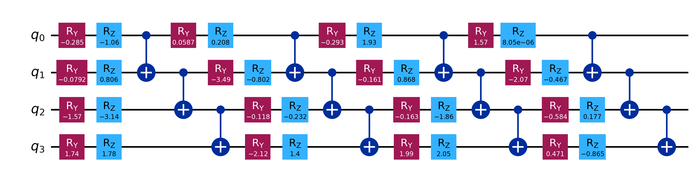
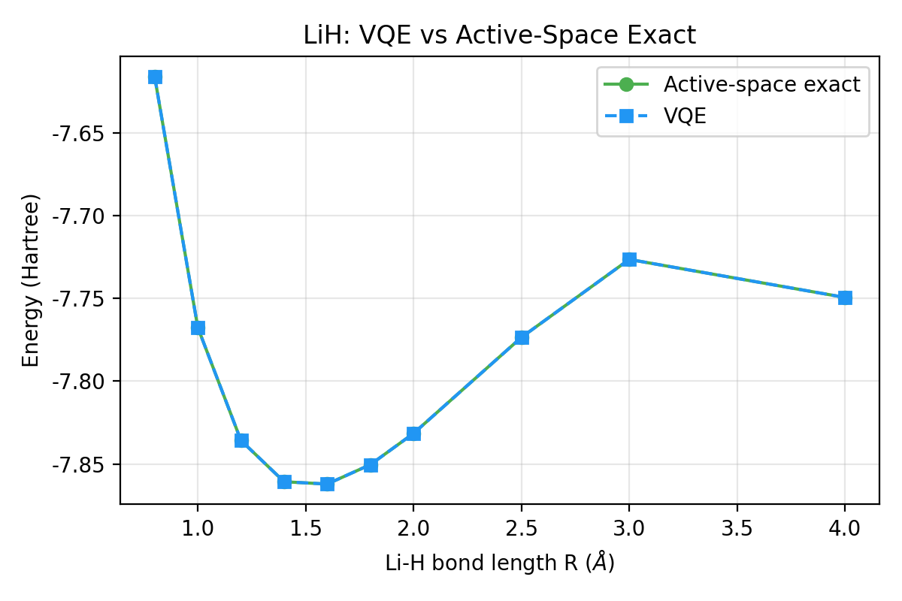
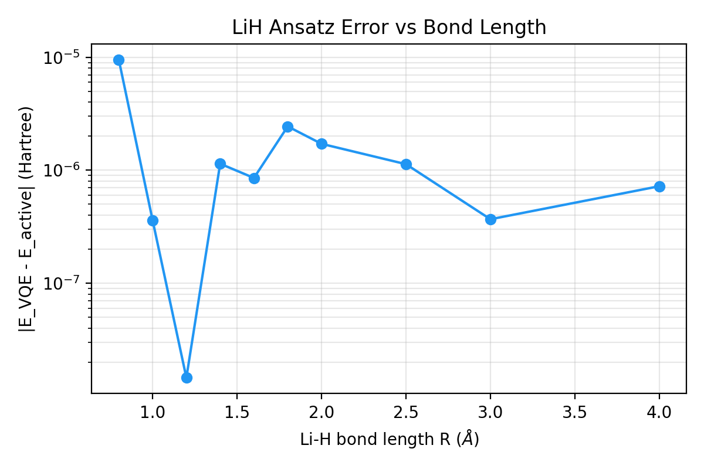

# 量子物理的“自动驾驶”：Auto-VQE 如何重塑量子化学模拟

> **“如果我们能像训练神经网络一样，让 AI 自动发现最适合描述原子世界的量子线路，那会发生什么？”**

在经典计算与量子计算的交叉点，一个激动人心的变革正在发生。传统的变分量子本征求解器（VQE）往往依赖于物理学家的直觉去手工设计量子线路结构（Ansatz）。然而，随着体系复杂度的提升，这种“手工作坊”模式已成为瓶颈。

**Auto-VQE 项目** 应运而生。它不是一个简单的计算脚本，而是一个具备“进化灵魂”的 AI Agent。通过结合遗传算法（GA）、启发式搜索和鲁棒的自动化训练流程，Auto-VQE 能够自主探索广袤的希尔伯特空间，发现人类直觉未必能触及的最优量子路径。

---

## 🚀 核心突破一：从混沌到 10⁻⁶ 的极限精度 (TFIM)

在一维横场伊辛模型（TFIM）的挑战赛中，Auto-VQE 展示了其无与伦比的“进化力”。

起初，随机生成的线路表现得平平无奇。但随着 AI Agent 不断调整门组（Gate Sets）和纠缠拓扑，奇迹发生了：
- **自主进化**: 在数十次架构探索与上千步的高精度训练后。
- **精度奇迹**: 能量误差直接从初期的显著水平下降到 **2.85 × 10⁻⁶**，成功收敛到极高精度。
- **極简美学**: 仅用 32 个参数，便完美刻画了 4-qubit 纠缠体系。

*图 1：TFIM 实验中的高精度收敛轨迹 —— 能量随步数迅速下降，展现了 AI 对量子景观的精准导航。*

*图 2：AI 自主进化出的最优 Ansatz 架构 —— 简洁、高效、充满逻辑。*

---

## 🧪 核心突破二：跨越时空的物理迁移 (LiH 解离曲线)

如果说 TFIM 验证了精度，那么 LiH（氢化锂）分子的几何扫描则验证了 Auto-VQE 的 **普适性 (Transferability)**。

面对分子键长从 **0.8 Å 到 4.0 Å** 的剧烈变化，AI 发现的一个固定 Ansatz 结构展现出了惊人的韧性。它不再需要专家针对每个几何构型重新建模，而是通过一套“结构通用、参数动态”的策略，完美绘制出了分子的分解曲线。

- **全覆盖精度**: 在全量程扫描中，Ansatz 与活性空间精确解的误差始终保持在 **10⁻⁷** 级别。
- **物理洞察**: 成功捕获了平衡键长（1.6 Å）及其在远距离下的解离行为。

*图 3：LiH 分子解离曲线对比 —— 虚线与实线的完美重合，宣告了 AI 设计线路的稳健性。*

*图 4：全量程误差分布 —— 无论键长如何伸缩，误差始终被压制在“尘埃”之下。*

---

## 🌟 愿景：将“量子灵感”还给机器

Auto-VQE 的成功不仅仅是几个数字的进步，它代表了一种范式的转变：
- **自动化**: 彻底解放科研人员的双手，让他们专注于更高维度的物理问题。
- **可扩展**: 从 4-qubit 到未来的 40-qubit，Auto-VQE 的算法框架具备横向扩张的潜力。
- **灵感启发**: 往往 AI 给出的奇怪门组合，能反过来启发物理学家对系统关联性的新认识。

我们正站在量子科学的新起点。Auto-VQE 证明了：当 AI 被赋予了量子力学的“视野”，它将成为人类探索微观世界最锋利的剑。

---
*作者：Auto-VQE 智能助手*
*日期：2026-03-11*
