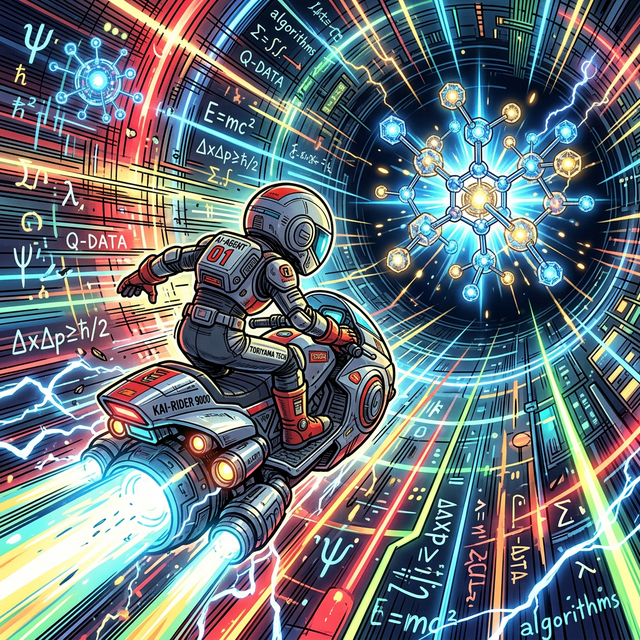

# Auto-VQE (Automatic Variational Quantum Eigensolver)

[中文版](#auto-vqe-自动量子物理学家)

An experiment to let LLMs automatically explore quantum circuit structures (Ansatz) to approximate the ground state energy of quantum systems such as the 1D Transverse Field Ising Model (TFIM) and LiH.

## Overview

The goal of this project is to use AI agents to iteratively design and optimize quantum circuits.  
The agent explores the "Conjecture" space (ansatz definitions in `experiments/*/run.py`) while being constrained by "Objective Reality" (Hamiltonians in `experiments/*/env.py` and the shared environment base class in `core/base_env.py`).

## Core Components

- **`core/circuit_factory.py` (The Compiler)**: The central hub for building quantum circuits from structured JSON configurations. It handles gate types, entanglement topologies, and parameter counting.
- **`core/search_algorithms.py` (The Architect)**: Implements evolutionary strategies like **Genetic Algorithms (GA)** to intelligently navigate the massive ansatz design space.
- **`experiments/tfim/run.py`, `experiments/lih/run.py` (Execution Engine)**: Now support **Config-Driven Execution**. They automatically load `best_config.json` produced by the search phase, decouples physical hypotheses from Python code.
- **`core/engine.py`**: Provides the reusable VQE training loop, logging utilities, and automatic experiment report generation.
- **`program.md`**: The experimental protocol and rules guiding the AI's exploration.
- **`baselines/` (Baseline Zoo)**: A standardized set of strong VQE baselines, each exposing `build_ansatz(env, config) -> AnsatzSpec`:
  - `baselines.hea` – hardware-efficient ansatz
  - `baselines.uccsd` – UCCSD-style chemistry-inspired ansatz
  - `baselines.hva` – Hamiltonian-Variational / QAOA-style ansatz
  - `baselines.adapt` – ADAPT-VQE style (proxy, forwards-compatible)
  - `baselines.qubit_adapt` – Qubit-ADAPT-VQE style (proxy, forwards-compatible)

## Key Principles

- **Occam's Razor**: Between two models with similar energy errors, the simpler one (fewer parameters, shallower depth) is preferred.
- **The Refutation Loop**: 
  1. Propose a new circuit hypothesis.
  2. Run the experiment to test the hypothesis.
  3. Evaluate the results (`val_energy`, `num_params`).
  4. Decide to keep or discard the change.

## Getting Started

Ensure you have [uv](https://github.com/astral-sh/uv) installed.

### Install dependencies

```bash
uv sync
```

### Run TFIM experiment

```bash
uv run python experiments/tfim/run.py
```

### Run LiH experiment

```bash
uv run python experiments/lih/run.py
```

Both experiments will:

- write detailed optimization logs to `experiments/<system>/vqe_*.log`
- append summary rows to `experiments/<system>/results.tsv`
- generate human-readable Markdown reports and circuit visualizations in the same directory
- append a **structured experiment record** to `experiments/<system>/results.jsonl`

### Structured Experiment Database (`results.jsonl`)

In addition to the lightweight `results.tsv`, each completed run now writes a
JSONL record capturing the full experiment context:

- `experiment_id`, `timestamp`, `system`, `exp_name`
- `seed`, `n_qubits`
- `ansatz_spec`: a standardized ansatz description dict (compatible with
  `baselines.AnsatzSpec.to_logging_dict()`), including:
  - `name` / `family` (e.g. `"hea"`, `"uccsd"`, `"hva"`, `"ga"`, `"multidim"`)
  - `env_name`, `n_qubits`, `num_params`
  - `config`: the structured config dict used to build the circuit
  - `metadata`: extra tags such as search strategy (`"ga"` / `"multidim"` / `"baseline"`)
- `optimizer_spec`: optimizer + scheduler hyperparameters
- `measurement_spec`: observable and exact energy used for evaluation
- `metrics`: `val_energy`, `energy_error`, `num_params`, `two_qubit_gates`,
  `runtime_sec`, etc.
- `decision`, `parent_experiment`, `change_summary`
- `git_diff`: patch of the current working tree vs. `HEAD`
- `artifact_paths`: paths to report Markdown, circuit PNG/JSON, convergence plots

This JSONL stream can be:

- loaded into pandas / DuckDB for analysis,
- converted into a SQLite / Parquet experiment database,
- used to train meta‑models / surrogate models over the ansatz space.

### Run Evolutionary Ansatz Search (GA)

For intelligent exploration over complex, multi-dimensional ansatz spaces using Genetic Algorithms:

```bash
# TFIM: evolutionary search over layers, gates, and topologies
uv run python experiments/tfim/ga_search.py

# LiH: evolutionary search over initialization, layers, and gate sets
uv run python experiments/lih/ga_search.py
```

The best found architecture is automatically saved to **`ga/best_config_ga.json`** in the same directory. Subsequently, `run.py` will prioritize loading this file for validation.

### Run Multi-Dimensional Search (Grid Search)

For comprehensive analysis of specific ansatz dimensions (e.g., layers vs topology):
The findings from multi-dimensional search experiments (as documented in the analysis reports in the **`multidim/`** folder) identify the most efficient configurations. These optimal "Ockham's Razor" configurations are saved as **`multidim/best_config_multidim.json`**.

---

---

# Auto-VQE (自动量子变分求解员)

[English Version](#auto-vqe-automatic-variational-quantum-eigensolver)

这是一个让 AI Agent 自动探索量子线路结构（Ansatz）以逼近量子体系（例如一维横场伊辛模型 TFIM、LiH）基态能量的实验。

## 项目概览

本项目旨在通过 AI Agent 迭代设计和优化量子线路。  
Agent 在“客观现实”（`core/base_env.py` 以及 `experiments/*/env.py` 中的哈密顿量）的约束下，探索“假设空间”（`experiments/*/run.py` 中的 ansatz 定义）。

## 核心组件

- **`core/circuit_factory.py`（线路编译器）**：核心组件，将结构化的 JSON 配置编译为量子线路。负责门类型、纠缠拓扑和参数计数逻辑。
- **`core/search_algorithms.py`（搜索算法库）**：实现**遗传算法 (GA)** 等进化策略，在数万种架构组合中智能导航，寻找最优解。
- **`experiments/tfim/run.py`、`experiments/lih/run.py`（执行引擎）**：现已支持**配置驱动模式**。自动加载搜索阶段产出的 `best_config.json`，实现了物理猜想与 Python 线路代码的完全解耦。
- **`core/engine.py`**：提供通用的 VQE 训练循环、日志记录与自动报告生成。
- **`program.md`**：指导 AI 探索的实验手册和规则。
- **`baselines/`（Baseline Zoo）**：一组**标准化基线 ansatz**，统一实现接口 `build_ansatz(env, config) -> AnsatzSpec`，便于：
  - Agent 在“强基线池”上进行探索与对比；
  - 系统性做 ablation 实验；
  - 论文中清晰回答“与哪些基线比较过”。 

## 核心原则

- **奥卡姆剃刀原则**: 在能量误差相近的情况下，优先选择更简单的模型（参数更少、线路更浅）。
- **证伪循环**:
  1. 提出新的线路假设。
  2. 运行实验验证假设。
  3. 评估指标（`val_energy`, `num_params`）。
  4. 决定保留或舍弃该改动。

## 快速开始

确保已安装 [uv](https://github.com/astral-sh/uv)。

### 安装依赖

```bash
uv sync
```

### 运行 TFIM 实验

```bash
uv run python experiments/tfim/run.py
```

### 运行 LiH 实验

```bash
uv run python experiments/lih/run.py
```

- 在 `experiments/<system>/` 下写入优化日志 `vqe_*.log`
- 追加实验摘要到 `results.tsv`
- 自动生成 Markdown 报告与量子线路可视化图像
- 将完整的实验上下文记录为结构化 JSON 行，写入 `results.jsonl`

### 结构化实验数据库（`results.jsonl`）

除了方便人眼扫描的 `results.tsv` 之外，每次实验结束时还会向
`experiments/<system>/results.jsonl` 追加一条结构化记录，包括：

- `experiment_id`、`timestamp`、`system`、`exp_name`
- `seed`、`n_qubits`
- `ansatz_spec`：统一的 ansatz 描述字典（与 `baselines.AnsatzSpec.to_logging_dict()` 兼容），包括：
  - `name` / `family`（如 `"hea"`、`"uccsd"`、`"hva"`、`"ga"`、`"multidim"`）
  - `env_name`、`n_qubits`、`num_params`
  - `config`：用于构造线路的结构化配置
  - `metadata`：额外标签（例如搜索策略 `"ga"` / `"multidim"` / `"baseline"`）
- `optimizer_spec`：优化器与学习率调度相关超参数
- `measurement_spec`：测量算符与精确能量
- `metrics`：`val_energy`、`energy_error`、`num_params`、`two_qubit_gates`、
  `runtime_sec`、`actual_steps` 等
- `decision`、`parent_experiment`、`change_summary`
- `git_diff`：当前工作区相对于 `HEAD` 的补丁 diff
- `artifact_paths`：报告 Markdown、线路 PNG/JSON、收敛曲线等文件路径

这使得后续可以：

- 构建真正的“实验 lineage”（通过 `parent_experiment` 串起实验树）；
- 训练 ansatz / optimizer 的 meta‑model 或 surrogate model；
- 直接用 pandas / DuckDB / SQLite 做统计分析和论文绘图。

### 运行遗传算法进化搜索 (GA Search)

使用进化策略在多维空间中智能寻找最优 ansatz：

```bash
# TFIM: 在层数、门类型、拓扑和参数策略维度进行演化
uv run python experiments/tfim/ga_search.py

# LiH: 在初始态、层数、量子门组合等维度进行演化
uv run python experiments/lih/ga_search.py
```

最优配置会自动持久化为该目录下的 **`ga/best_config_ga.json`**。

### 运行多维网格搜索 (Multi-Dimensional Search)

用于对特定维度进行穷举分析。通过该策略发现的高效极简配置（遵循奥卡姆剃刀原则）会保存为 **`multidim/best_config_multidim.json`**，详细分析见对应的子文件夹。

**Note**: `run.py` will automatically prioritize loading configurations in this order: `ga/` > `multidim/` > root directory config.

## Acknowledgements

- Inspired by [karpathy/autoresearch](https://github.com/karpathy/autoresearch).
