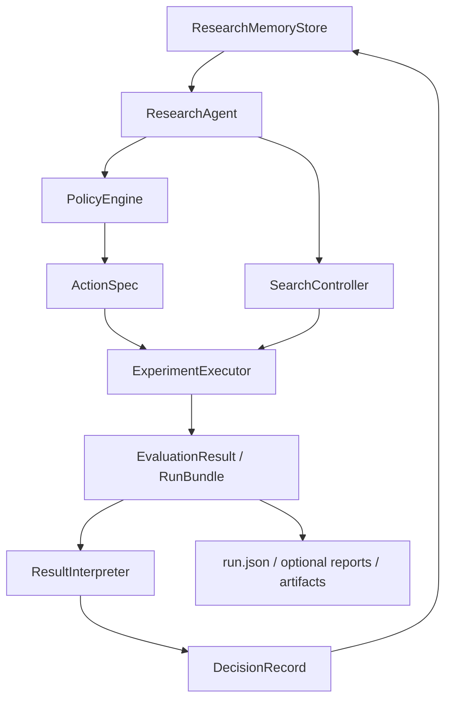

# Agent-VQE Agent 架构设计图与模块接口草案

> 版本：0.1
> 状态：设计已部分落地
> 更新时间：2026-03-29

## 1. 目标

把当前仓库从“可由 Agent 使用的实验框架”推进到“以 Agent 为研究控制中枢的自动科研系统”。

本文记录两部分内容：

- 当前已落地的单 Agent 运行时结构
- 仍然可继续演进的接口与模块方向

本文不试图替换数值优化器或物理环境定义。Agent 负责研究控制，不负责重写客观物理层。

## 2. 设计原则

- 保持 `QuantumEnvironment` 与具体物理问题定义为不可变现实。
- 让 Agent 决策作用于“猜想空间、预算分配、实验调度、结果解释”。
- Agent 的输出必须结构化落盘，不能只存在 prompt 或对话里。
- 先做单 Agent 可闭环，再扩展为多 Agent 协作。
- 与当前 `schema_version = 1.2` 的实验日志体系对齐，而不是另起一套孤立记录。

## 3. 分层架构

### 3.1 当前系统映射

- Reality Layer
  - `core/foundation/base_env.py`
  - `experiments/tfim/env.py`
  - `experiments/lih/env.py`
- Search Layer
  - `core/generator/ga.py`
  - `core/generator/grid.py`
  - `core/generator/adapt.py`
- Evaluation Layer
  - `core/evaluator/api.py`
  - `core/evaluator/training.py`
  - `core/evaluator/report.py`
- Control Layer
  - `core/orchestration/controller.py`
  - `core/research/runtime.py`
  - `core/research/agent.py`
  - `core/research/session.py`

### 3.2 目标分层

- Reality Layer
  - 保持当前不变
- Execution Layer
  - 统一实验入口与候选评估
- Agent Policy Layer
  - 生成研究假设、选择动作、解释结果、更新记忆
- Memory Layer
  - 保存 hypothesis、evidence、dead ends、transferable insights
- Audit Layer
  - 对齐 `run.json`、autoresearch log、artifact paths

## 4. 单 Agent 研究员架构图



这个架构里，`ResearchAgent` 不是直接训练量子线路，而是调度以下 4 件事：

- 读取记忆
- 形成假设
- 选择动作
- 根据证据更新记忆

当前已落地的运行时文件：

- `core/model/research_schemas.py`
- `core/research/runtime.py`
- `core/research/agent.py`
- `core/research/policy.py`
- `core/research/executor.py`
- `core/research/interpreter.py`
- `core/research/session.py`
- `core/research/memory_store.py`

## 5. 核心对象

### 5.1 `HypothesisSpec`

用途：表达“这一轮到底想验证什么”。

建议新增位置：

- `core/model/research_schemas.py`

建议字段：

```python
class HypothesisSpec(BaseModel):
    hypothesis_id: str
    parent_hypothesis_id: str | None = None
    system: str
    objective: str
    statement: str
    motivation: str | None = None
    target_metric: str = "energy_error"
    expected_effect: str | None = None
    search_region: dict[str, Any] = Field(default_factory=dict)
    assumptions: list[str] = Field(default_factory=list)
    priority: int = 1
    created_by: str = "policy_engine"
    status: Literal["open", "tested", "accepted", "rejected"] = "open"
```

说明：

- `statement` 是本轮研究猜想，例如“先降低层数再微调门集，可能在相近误差下减少参数数目”。
- `search_region` 用于约束本轮动作允许触碰的结构维度。
- `parent_hypothesis_id` 支持形成推理链，而不是每轮都像重新开始。

### 5.2 `ActionSpec`

用途：表达 Agent 本轮要执行什么动作。

建议新增位置：

- `core/model/research_schemas.py`

建议字段：

```python
class ActionSpec(BaseModel):
    action_id: str
    hypothesis_id: str
    system_dir: str
    action_type: Literal[
        "run_strategy",
        "verify_config",
        "promote_candidate",
        "reduce_search_space",
        "switch_strategy",
        "stop_research",
    ]
    strategy_name: str | None = None
    fidelity: Literal["quick", "medium", "full"] | None = None
    budget: dict[str, Any] = Field(default_factory=dict)
    config_path: str | None = None
    candidate_ids: list[str] = Field(default_factory=list)
    search_space_patch: dict[str, Any] = Field(default_factory=dict)
    rationale: str | None = None
```

说明：

- 这是连接 policy 和 executor 的关键对象。
- `search_space_patch` 允许 Agent 只在局部缩放搜索空间，而不是重写整份配置。

### 5.3 `DecisionRecord`

用途：保存 Agent 如何解释结果以及最终决策。

建议新增位置：

- `core/model/research_schemas.py`

建议字段：

```python
class DecisionRecord(BaseModel):
    decision_id: str
    iteration: int
    hypothesis_id: str
    action_id: str
    decision: Literal["keep", "discard", "refine", "promote", "stop"]
    summary: str
    evidence_for: list[str] = Field(default_factory=list)
    evidence_against: list[str] = Field(default_factory=list)
    confidence: float = 0.5
    selected_config_path: str | None = None
    selected_candidate_id: str | None = None
    followup_actions: list[str] = Field(default_factory=list)
```

说明：

- 当前 `ResearchSession.log_decision()` 里有 `decision` 和 `rationale`，但还没有 `evidence_for / evidence_against / confidence` 这一层。
- 这会让 keep/discard 更像研究判断，而不是单阈值比较。

### 5.4 `ResearchMemory`

用途：汇总当前研究状态，供下一轮读取。

建议新增位置：

- `core/model/research_schemas.py`

建议字段：

```python
class ResearchMemory(BaseModel):
    system: str
    objective: str
    best_energy_error: float | None = None
    best_candidate_id: str | None = None
    best_config_path: str | None = None
    active_hypotheses: list[HypothesisSpec] = Field(default_factory=list)
    accepted_hypotheses: list[str] = Field(default_factory=list)
    rejected_hypotheses: list[str] = Field(default_factory=list)
    dead_ends: list[str] = Field(default_factory=list)
    transferable_insights: list[str] = Field(default_factory=list)
    strategy_stats: dict[str, Any] = Field(default_factory=dict)
    last_decision: DecisionRecord | None = None
    next_recommendations: list[str] = Field(default_factory=list)
```

说明：

- 当前 `autoresearch.md` 已有 brain 概念，但还不是结构化对象。
- 建议把 `md` 变成人类可读视图，把 `json` 变成 Agent 可读源。

### 5.5 `RunBundle`

用途：统一一次动作执行后的结果封装。

建议新增位置：

- `core/model/research_schemas.py`

建议字段：

```python
class RunBundle(BaseModel):
    action: ActionSpec
    metrics: dict[str, Any] = Field(default_factory=dict)
    candidate_results: list[EvaluationResult] = Field(default_factory=list)
    artifact_paths: dict[str, str] = Field(default_factory=dict)
    selected_config_path: str | None = None
    success: bool = True
    error_message: str | None = None
```

说明：

- 当前 `driver.run_iteration()` 主要依赖 shell 输出里的 `METRIC ...` 解析。
- `RunBundle` 的目标是把“解析脚本输出”升级为“消费统一结构对象”。

## 6. 模块设计

### 6.1 `ResearchAgent`

职责：

- 协调单轮研究闭环
- 连接 memory、policy、executor、interpreter
- 对外提供 `step()` 与 `run_until_stop()`

建议新增位置：

- `core/research/agent.py`

建议接口：

```python
class ResearchAgent:
    def __init__(
        self,
        system_dir: str,
        memory_store: "ResearchMemoryStore",
        policy_engine: "PolicyEngine",
        executor: "ExperimentExecutor",
        interpreter: "ResultInterpreter",
        controller: SearchController | None = None,
    ): ...

    def step(self, iteration: int) -> DecisionRecord: ...

    def run_until_stop(self, max_loops: int, target_error: float | None = None) -> list[DecisionRecord]: ...
```

建议行为：

1. 从 `memory_store.load()` 读取 `ResearchMemory`
2. 用 `policy_engine.plan_next_action(...)` 生成 `HypothesisSpec + ActionSpec`
3. 用 `executor.execute(action)` 得到 `RunBundle`
4. 用 `interpreter.interpret(...)` 生成 `DecisionRecord`
5. 写回 `memory_store.append_decision(...)` 与 `memory_store.update_memory(...)`

### 6.2 `PolicyEngine`

职责：

- 决定“下一轮做什么”
- 控制探索与利用
- 管理策略切换与搜索空间收缩

建议新增位置：

- `core/research/policy.py`

建议接口：

```python
class PolicyEngine:
    def propose_hypothesis(
        self,
        memory: ResearchMemory,
        controller: SearchController,
    ) -> HypothesisSpec: ...

    def plan_next_action(
        self,
        memory: ResearchMemory,
        controller: SearchController,
    ) -> ActionSpec: ...
```

第一版建议先用规则策略，不直接依赖 LLM：

- 如果连续无改进，优先 `switch_strategy` 或 `reduce_search_space`
- 如果 quick fidelity 有明显改进，优先 `promote_candidate`
- 如果当前最优已经接近 target，优先 `verify_config`
- 如果某个方向连续多次失败，记录为 `dead_end`

后续才把 LLM 接到 `PolicyEngine` 里，做带约束的建议，而不是裸生成动作。

### 6.3 `ExperimentExecutor`

职责：

- 严格执行 `ActionSpec`
- 屏蔽脚本入口差异
- 统一返回 `RunBundle`

建议新增位置：

- `core/research/executor.py`

建议接口：

```python
class ExperimentExecutor:
    def execute(self, action: ActionSpec) -> RunBundle: ...
    def run_strategy(self, action: ActionSpec) -> RunBundle: ...
    def verify_config(self, action: ActionSpec) -> RunBundle: ...
```

第一版执行策略：

- `run_strategy`
  - 兼容当前 `experiments/*/run.py search ga`、`experiments/*/run.py search multidim`
- `verify_config`
  - 兼容当前 `experiments/*/run.py --config ...`
- `promote_candidate`
  - 调用 `core/evaluator/api.py` 中的 `promote_candidate(...)`

建议逐步把 shell 脚本入口替换成 Python API，使 `driver` 不再依赖 stdout 中的 `METRIC` 行。

### 6.4 `ResultInterpreter`

职责：

- 从 `RunBundle` 生成研究语义上的判断
- 不只看最优能量，还看复杂度、稳定性、运行代价

建议新增位置：

- `core/research/interpreter.py`

建议接口：

```python
class ResultInterpreter:
    def interpret(
        self,
        memory: ResearchMemory,
        hypothesis: HypothesisSpec,
        run: RunBundle,
    ) -> DecisionRecord: ...
```

建议判定逻辑：

- `keep`
  - `energy_error` 显著下降
- `promote`
  - quick fidelity 明显优于同批候选
- `refine`
  - 精度略有提升但复杂度偏高，值得局部缩减搜索空间后再试
- `discard`
  - 没有 Pareto 改进，或稳定性太差
- `stop`
  - 达到 target 或预算耗尽

### 6.5 `ResearchMemoryStore`

职责：

- 保存与加载结构化记忆
- 生成面向人读的摘要
- 保持与现有 `autoresearch.jsonl`、`autoresearch.md` 兼容

建议新增位置：

- `core/research/memory_store.py`

建议接口：

```python
class ResearchMemoryStore:
    def load(self) -> ResearchMemory: ...
    def save(self, memory: ResearchMemory) -> None: ...
    def append_decision(self, decision: DecisionRecord, run: RunBundle) -> None: ...
    def render_markdown(self, memory: ResearchMemory) -> str: ...
```

建议存储文件：

- `research_memory.json`
- `autoresearch.jsonl`
- `autoresearch.md`

其中：

- `research_memory.json` 是机器读写主状态
- `autoresearch.jsonl` 是逐轮事件流
- `autoresearch.md` 是人类浏览摘要

## 7. 调用流

### 7.1 单轮调用流

```text
ResearchAgent.step(iteration)
  -> memory_store.load()
  -> policy_engine.propose_hypothesis()
  -> policy_engine.plan_next_action()
  -> executor.execute(action)
  -> interpreter.interpret(memory, hypothesis, run_bundle)
  -> memory_store.append_decision(...)
  -> memory_store.save(updated_memory)
  -> return decision_record
```

### 7.2 与当前 runtime 入口的关系

建议演进方式：

- 第一步
  - 统一使用 [core/research/runtime.py](/Users/qianlong/tries/2026-03-10-auto-vqe/core/research/runtime.py) 作为恢复与运行时入口
  - 内部改为实例化 `ResearchAgent`
- 第二步
  - 把 `run_iteration(...)` 的 shell 调用逻辑迁移进 `ExperimentExecutor`
- 第三步
  - 让 `runtime.py` 负责 CLI / 恢复入口与 `agent.run_until_stop(...)`

目标是把当前 procedural script 改造成 orchestration entrypoint，而不是废弃它。

## 8. 与现有文件的映射关系

### 8.1 保持不变

- `core/foundation/base_env.py`
- `experiments/tfim/env.py`
- `experiments/lih/env.py`
- `core/evaluator/training.py`

### 8.2 需要轻改

- `core/research/runtime.py`
  - 改为 Agent 主入口
- `core/research/session.py`
  - 渐进迁移到 `ResearchMemoryStore`
- `core/orchestration/controller.py`
  - 保持预算与停止规则
  - 补充可供 policy 消费的状态快照方法

### 8.3 建议新增

- `core/model/research_schemas.py`
- `core/research/agent.py`
- `core/research/policy.py`
- `core/research/executor.py`
- `core/research/interpreter.py`
- `core/research/memory_store.py`

## 9. 与现有 schema 的对齐策略

当前已有：

- `CandidateSpec`
- `EvaluationSpec`
- `EvaluationResult`
- `StrategyCheckpoint`

建议新增的 research schema 不替代这些对象，而是站在它们上层：

- `HypothesisSpec` 关注研究意图
- `ActionSpec` 关注执行动作
- `RunBundle` 关注一次动作的实际产出
- `DecisionRecord` 关注研究判断
- `ResearchMemory` 关注跨轮累积状态

对齐关系如下：

```text
HypothesisSpec
  -> ActionSpec
    -> CandidateSpec / EvaluationSpec
      -> EvaluationResult
        -> RunBundle
          -> DecisionRecord
            -> ResearchMemory
```

## 10. 目录与产物建议

对每个 autoresearch session，建议目录如下：

```text
experiments/<system>/artifacts/runs/autoresearch/<timestamp>_<strategy>_autoresearch/
  driver.log
  autoresearch.jsonl
  autoresearch.md
  research_memory.json
  iterations/
    iter_0001/
    iter_0002/
```

其中：

- `iterations/iter_xxxx/` 存放本轮动作的运行目录或快捷链接
- `research_memory.json` 记录聚合状态
- `autoresearch.jsonl` 记录逐轮 append-only 决策事件

## 11. 第一阶段落地计划

### M1：引入 research schema

新增：

- `core/model/research_schemas.py`

完成标准：

- `HypothesisSpec`
- `ActionSpec`
- `DecisionRecord`
- `ResearchMemory`
- `RunBundle`

### M2：把 session 从“文件助手”升级成 memory store

新增：

- `core/research/memory_store.py`

兼容：

- 保留现有 `autoresearch.jsonl`
- 自动生成 `autoresearch.md`

### M3：把 driver 升级成 agent runner

新增：

- `core/research/agent.py`
- `core/research/policy.py`
- `core/research/interpreter.py`

修改：

- `core/research/runtime.py`

### M4：把实验执行封装到 executor

新增：

- `core/research/executor.py`

完成标准：

- `runtime.py` 不再手工解析 shell 输出作为唯一真相来源

## 12. 非目标

- 不让 Agent 直接修改物理环境定义
- 不在第一阶段引入完全自由生成的 LLM 搜索空间
- 不在没有约束和审计的前提下让 Agent 自动改核心训练逻辑

## 13. 一句话总结

这个仓库最值得做的 Agent 化，不是“让模型直接生成量子线路”，而是把：

- `driver` 变成 Agent runner
- `session` 变成 structured memory
- `orchestrator/controller` 变成 policy runtime

这样 Agent 才不是外挂，而是研究流程本身的控制层。
