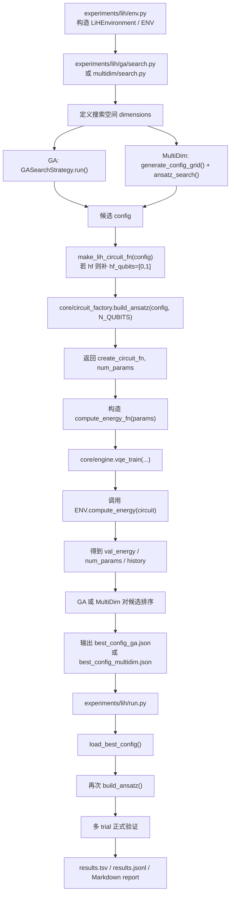
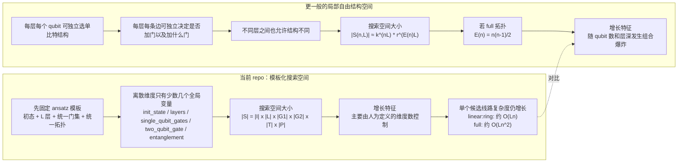

# LiH 视角下的 Repo 全流程梳理

本文从 `LiH` 这个具体任务出发，重新梳理整个仓库是如何运作的，重点解释：

- 这个 repo 的核心层次是怎么分工的
- `ga` 是如何搜索 ansatz 的
- `multidim` 是如何搜索 ansatz 的
- 两者共用的训练与评估链路是什么
- 搜索结果最后如何进入正式实验与报告生成

---

## 1. 一句话理解这个仓库

这个仓库不是“只跑一次 LiH VQE”的脚本集合，而是一个自动 ansatz 搜索框架。

以 LiH 为例，它做的事情可以概括成：

1. 先定义 LiH 的哈密顿量和精确能量
2. 再定义一类可搜索的候选量子线路模板
3. 用 `ga` 或 `multidim` 在这个结构空间里找候选 ansatz
4. 对每个候选 ansatz 跑内层 VQE 参数优化
5. 挑出最优结构，再用统一入口做正式验证和落盘

---

## 2. 从 LiH 出发看 repo 的五层结构

以 LiH 为例，整个仓库大致可以分成五层：

1. 环境层：定义“客观现实”
2. 线路构造层：定义“候选线路长什么样”
3. 搜索策略层：定义“怎么挑候选结构”
4. 评估执行层：定义“怎么训练并评价一个候选”
5. 实验入口层：定义“怎么组织一次完整实验”

对应关键文件如下：

- 环境层: [env.py](/Users/qianlong/tries/2026-03-10-auto-vqe/experiments/lih/env.py)
- 线路构造层: [circuit_factory.py](/Users/qianlong/tries/2026-03-10-auto-vqe/core/circuit_factory.py)
- GA 搜索: [search.py](/Users/qianlong/tries/2026-03-10-auto-vqe/experiments/lih/ga/search.py)
- MultiDim 搜索: [search.py](/Users/qianlong/tries/2026-03-10-auto-vqe/experiments/lih/multidim/search.py)
- GA 策略实现: [search_algorithms.py](/Users/qianlong/tries/2026-03-10-auto-vqe/core/search_algorithms.py)
- Grid / 统一搜索执行: [engine.py](/Users/qianlong/tries/2026-03-10-auto-vqe/core/engine.py)
- 正式运行入口: [run.py](/Users/qianlong/tries/2026-03-10-auto-vqe/experiments/lih/run.py)

---

## 3. 环境层：LiH 问题是如何被定义的

[env.py](/Users/qianlong/tries/2026-03-10-auto-vqe/experiments/lih/env.py) 的作用，是把 LiH 变成一个可被搜索框架调用的量子环境。

它主要负责三件事：

### 3.1 加载 LiH 的问题数据

优先从 `lih_pyscf_data.json` 中读取预先生成的 LiH 数据，包括：

- qubit 数
- Pauli 展开的哈密顿量
- active-space exact energy
- full FCI energy
- HF / CCSD 等参考量

如果没有外部数据，则退回到仓库中的 toy Hamiltonian。

### 3.2 构造统一环境对象

`LiHEnvironment` 继承自 `QuantumEnvironment`，对外暴露最关键的几个属性：

- `n_qubits`
- `exact_energy`
- `compute_energy(circuit)`

这让上层搜索算法不需要理解化学细节，只需要反复问：

> 给定一条量子线路，这条线路在 LiH 哈密顿量下的能量是多少？

### 3.3 提供默认全局入口

文件末尾的 `ENV = LiHEnvironment()` 让实验脚本可以直接拿到默认 LiH 环境。

---

## 4. 线路构造层：候选 ansatz 是怎么组成的

LiH 上的候选线路不是任意量子线路，而是由 [circuit_factory.py](/Users/qianlong/tries/2026-03-10-auto-vqe/core/circuit_factory.py) 中的 `build_ansatz()` 从结构化 `config` 编译出来的。

### 4.1 一个候选 config 里通常包含什么

对于 LiH，常见的搜索维度包括：

- `init_state`
- `layers`
- `single_qubit_gates`
- `two_qubit_gate`
- `entanglement`
- `param_strategy`

在 LiH 脚本里，若选择 `hf` 初态，还会自动补上：

- `hf_qubits = [0, 1]`

见：

- [ga/search.py](/Users/qianlong/tries/2026-03-10-auto-vqe/experiments/lih/ga/search.py)
- [multidim/search.py](/Users/qianlong/tries/2026-03-10-auto-vqe/experiments/lih/multidim/search.py)

### 4.2 候选线路编译后的形状

一个候选 ansatz 通常是下面这种模板：

1. 准备初态
2. 重复若干层
3. 每层先施加单比特旋转门
4. 再按拓扑施加双比特纠缠门

更具体一点：

- `init_state = zero` 时，从零态开始
- `init_state = hf` 时，准备 Hartree-Fock 比特占据
- `single_qubit_gates` 决定每层的局部旋转门集合
- `entanglement` 决定 qubit pair 的连边方式
- `two_qubit_gate` 决定每条边上放什么纠缠门

### 4.3 这意味着什么

这意味着：

- `ga` 和 `multidim` 搜索的是“线路模板的离散结构参数”
- 它们不是直接搜索任意 unitary
- 它们也不是 ADAPT 那种“从算符池逐个追加算符”的机制

---

## 5. LiH 的 GA 是如何运作的

入口文件是 [ga/search.py](/Users/qianlong/tries/2026-03-10-auto-vqe/experiments/lih/ga/search.py)。

### 5.1 GA 定义的搜索空间

LiH 的 GA 搜索空间是：

- `init_state`: `zero`, `hf`
- `layers`: `2, 3, 4, 5`
- `single_qubit_gates`: `["ry"]`, `["ry", "rz"]`, `["rx", "ry", "rz"]`
- `two_qubit_gate`: `cnot`, `rzz`, `rxx_ryy_rzz`
- `entanglement`: `linear`, `ring`, `full`

这本质上定义了一个离散结构空间。

### 5.2 GA 的总体流程

GA 的核心实现位于 [search_algorithms.py](/Users/qianlong/tries/2026-03-10-auto-vqe/core/search_algorithms.py) 的 `GASearchStrategy`。

它的工作流程是：

1. 随机初始化一批候选 config 作为种群
2. 对种群中每个 config 做评估
3. 按能量和参数复杂度排序
4. 保留 elite
5. 通过交叉和变异生成新一代
6. 重复多代，直到代数结束或预算耗尽

### 5.3 一个 config 是如何被评估的

对每个候选 config，GA 会：

1. 调用 `make_lih_circuit_fn(config)`
2. 如果是 `hf` 初态，自动补充 `hf_qubits`
3. 调用 `build_ansatz(config, N_QUBITS)`
4. 得到：
   - `create_circuit_fn`
   - `num_params`
5. 基于 `create_circuit_fn` 和 `ENV.compute_energy` 构造目标函数
6. 跑若干次 `vqe_train`
7. 取该 config 的最佳 trial 结果

### 5.4 GA 怎么决定谁更好

GA 的排序逻辑是：

1. 先看 `val_energy`
2. 若能量非常接近，则优先参数更少的结构

也就是典型的：

- 先追求更低能量
- 在近似持平时，遵循奥卡姆剃刀

### 5.5 GA 的交叉和变异发生在哪里

GA 的结构更新不是在量子线路层面做，而是在 `config dict` 层面做：

- `mutate_config()`
- `crossover_configs()`

两者都位于 [circuit_factory.py](/Users/qianlong/tries/2026-03-10-auto-vqe/core/circuit_factory.py)。

所以 GA 演化的是“配置”，不是“参数向量”，也不是“矩阵”。

### 5.6 GA 的最终产物

GA 搜索完成后会输出：

- `best_config_ga.json`
- 对应的 Markdown 报告
- 日志文件
- 结构化结果记录

---

## 6. LiH 的 multidim 是如何运作的

入口文件是 [multidim/search.py](/Users/qianlong/tries/2026-03-10-auto-vqe/experiments/lih/multidim/search.py)。

### 6.1 multidim 的搜索空间

LiH 的 multidim 搜索空间通常比 GA 更小、更保守：

- `init_state`: `zero`, `hf`
- `layers`: `1, 2, 3, 4`
- `single_qubit_gates`: `["ry"]`, `["ry", "rz"]`
- `two_qubit_gate`: `cnot`, `rzz`
- `entanglement`: `linear`, `ring`

### 6.2 multidim 的核心思路

它不做进化，也不依赖随机繁殖。

它的核心思路是：

1. 先把所有候选维度展开成笛卡尔积
2. 逐个评估每一个 config
3. 在全部结果中选出最优结构

### 6.3 配置列表是怎么生成的

`generate_config_grid(dimensions)` 会把每个维度做乘积组合，生成完整的 `config_list`。

例如：

- 2 个初态
- 4 个层数
- 2 个单比特门集合
- 2 个双比特门
- 2 个拓扑

最终会形成一批离散候选配置。

### 6.4 multidim 的评估过程

`multidim` 调用的是 [engine.py](/Users/qianlong/tries/2026-03-10-auto-vqe/core/engine.py) 里的 `ansatz_search()`。

它会对 `config_list` 中的每个 config 依次：

1. 编译成线路
2. 跑一轮或多轮 `vqe_train`
3. 记录该 config 的最好结果
4. 与当前全局最好结果比较

### 6.5 multidim 的适用场景

`multidim` 更像是系统性扫空间，适合：

- 搜索维度不大时做全面比较
- 想更清楚地看清某些结构维度对性能的影响
- 做更可解释的 ablation

相比之下，GA 更像是在大空间里做启发式探索。

### 6.6 multidim 的最终产物

它最终也会生成：

- `best_config_multidim.json`
- 搜索日志
- 结果记录
- 报告和分析文件

---

## 7. GA 和 multidim 的共同内核：统一评估链路

虽然 `ga` 和 `multidim` 的外层搜索机制不同，但它们在“评估一个候选结构”时，走的是同一条链路。

统一链路如下：

1. `config`
2. `build_ansatz(config, n_qubits)`
3. `create_circuit_fn`
4. `compute_energy_fn(params)`
5. `vqe_train(...)`
6. 返回：
   - `val_energy`
   - `num_params`
   - `training_seconds`
   - `actual_steps`
   - 其他训练统计

这意味着：

- 外层策略决定“试哪些结构”
- 内层评估决定“这个结构训练后表现如何”

这是这个 repo 很核心的设计点：搜索策略和物理评估是解耦的。

---

## 8. LiH 的正式实验入口是怎么衔接搜索结果的

[run.py](/Users/qianlong/tries/2026-03-10-auto-vqe/experiments/lih/run.py) 是 LiH 的正式运行入口。

它会自动按优先级加载最佳配置：

1. `ga/best_config_ga.json`
2. `multidim/best_config_multidim.json`
3. 其他 fallback 配置

然后做正式评估：

1. 读取最佳 config
2. 编译成电路
3. 多次独立 trial 运行 `vqe_train`
4. 选择最佳结果
5. 记录日志、报告、结果表

也就是说：

- `ga` / `multidim` 负责“找结构”
- `run.py` 负责“用统一协议验证这个结构”

---

## 9. 调用链图

下面用 Mermaid 把 LiH 的两条主要调用链串起来。

---

## 10. 两条搜索路径的本质差别

把 LiH 上的 `ga` 和 `multidim` 放在一起看，可以这样总结：

### 10.1 GA

- 搜索方式：进化式启发搜索
- 优点：更适合较大结构空间
- 缺点：结果带随机性，解释性不如穷举直观

### 10.2 multidim

- 搜索方式：网格穷举
- 优点：系统、可解释、容易做维度分析
- 缺点：空间一大就很快爆炸

### 10.3 共同点

- 都搜索同一类结构化 ansatz 模板
- 都通过 `build_ansatz()` 编译电路
- 都通过 `vqe_train()` 做内层参数优化
- 都用统一标准比较候选表现

---

## 11. 一个最重要的理解框架

如果只保留一个理解框架，我建议用下面这句话记住 LiH 上的整个 repo：

> LiH 环境定义了“我们要逼近什么”，`circuit_factory` 定义了“我们允许尝试什么样的线路”，`ga / multidim` 定义了“我们按什么策略挑线路”，而 `engine` 定义了“我们如何公平地评估这些线路”。

这也是这个项目从“实验脚本”升级为“自动 ansatz 搜索框架”的核心。

---

## 12. 一个关键问题：离散搜索空间会如何随 qubit 数和层深增长

这一点非常关键，因为当前 repo 的 `ga` 和 `multidim` 都建立在一个前提上：

> 我们必须先人为定义一个离散搜索空间，然后再在这个空间里搜索。

所以真正的问题不是“量子线路理论上有多少种”，而是：

> 在当前 ansatz 模板下，允许搜索的候选线路数量会怎样增长？

### 12.1 当前 repo 中，搜索空间是如何被压缩的

当前 repo 并没有允许“任意量子线路”进入搜索，而是把候选结构限制为一类模板化 ansatz。

以 LiH 为例，一个候选 config 常见地只包含以下几个离散维度：

- `init_state`
- `layers`
- `single_qubit_gates`
- `two_qubit_gate`
- `entanglement`
- `param_strategy`（部分脚本会省略）

这意味着当前 repo 搜索的不是“所有可能线路”，而只是“这一类模板中的超参数组合”。

### 12.2 在当前模板设定下，候选配置总数怎么计算

如果每个维度都是全局共享的，也就是：

- 整个电路只选择一种初态
- 整个电路只选择一个层数
- 每一层都使用同一种单比特门集合
- 每一层都使用同一种双比特门类型
- 每一层都使用同一种纠缠拓扑

那么搜索空间大小只是各维度可选数目的乘积：

\[
|\mathcal S| = |I| \cdot |L| \cdot |G_1| \cdot |G_2| \cdot |T| \cdot |P|
\]

这里：

- \(I\): 初态选择数
- \(L\): 层数候选数
- \(G_1\): 单比特门集合候选数
- \(G_2\): 双比特门候选数
- \(T\): 拓扑候选数
- \(P\): 参数共享策略候选数

这个表达式非常重要，因为它说明：

- 在当前 repo 的模板下，候选 config 的数量不一定直接随 qubit 数指数增长
- 它首先受“你定义了多大的离散空间”控制

### 12.3 LiH 当前脚本中的具体数量

以 LiH 的 `multidim` 为例，搜索空间是：

- `init_state`: 2 种
- `layers`: 4 种
- `single_qubit_gates`: 2 种
- `two_qubit_gate`: 2 种
- `entanglement`: 2 种

所以总配置数是：

\[
2 \times 4 \times 2 \times 2 \times 2 = 64
\]

以 LiH 的 `ga` 为例，搜索空间是：

- `init_state`: 2 种
- `layers`: 4 种
- `single_qubit_gates`: 3 种
- `two_qubit_gate`: 3 种
- `entanglement`: 3 种

所以总配置数是：

\[
2 \times 4 \times 3 \times 3 \times 3 = 216
\]

这说明当前实验中的结构空间其实并不算大。

### 12.4 但每个候选线路本身会随 qubit 数和层深变大

虽然当前 `config` 总数不一定随 qubit 数爆炸，但每一个候选线路本身的规模会增长很快。

设：

- \(n\): qubit 数
- \(L\): 层数
- \(m\): 每层包含的单比特门类型数
- \(E(n)\): 某种拓扑下每层的双比特连边数

那么每个候选线路的门数大致可以写成：

\[
\text{GateCount}(n,L) \approx L \cdot (m n + E(n))
\]

不同拓扑下，\(E(n)\) 的规模不同：

- `linear`: \(E(n) = n - 1\)
- `ring`: \(E(n) = n\)
- `brick`: \(E(n) \approx n/2\)
- `full`: \(E(n) = \frac{n(n-1)}{2}\)

因此：

- `linear` / `ring` / `brick` 下，线路规模大致随 \(L n\) 增长
- `full` 下，线路规模大致随 \(L n^2\) 增长

这会直接影响：

- 训练时间
- 参数数量
- 梯度优化难度
- 模拟成本

### 12.5 真正的组合爆炸来自哪里

真正可怕的爆炸，不是“当前 repo 的模板空间”，而是“如果你把模板放松到每个位置都能自由选”。

例如，如果你允许：

- 每层的每个 qubit 都独立选单比特门类型
- 每层的每条边都独立决定是否放门、放哪种门
- 不同层之间的结构也完全独立

那么搜索空间就会从“几个全局维度的乘积”，变成“每个局部位置独立选择”的组合空间。

设：

- 每个 qubit 在每层有 \(k\) 种单比特结构可选
- 每条边在每层有 \(r\) 种双比特结构可选

则总空间大小大约会变成：

\[
|\mathcal S(n,L)| \approx k^{nL} \cdot r^{E(n)L}
\]

如果使用 `full` 拓扑，则：

\[
E(n) = \frac{n(n-1)}{2}
\]

于是：

\[
|\mathcal S(n,L)| \approx k^{nL} \cdot r^{\frac{n(n-1)}{2}L}
\]

这就是标准的组合爆炸。

### 12.6 一个直观例子

假设：

- \(n = 20\)
- \(L = 4\)
- 每个 qubit 每层有 \(k = 3\) 种单比特结构可选
- 每条边每层有 \(r = 2\) 种双比特结构可选
- 使用 `full` 拓扑

则边数为：

\[
E(20) = \frac{20 \times 19}{2} = 190
\]

空间大小大约为：

\[
3^{80} \cdot 2^{760}
\]

这个数量已经远远超出穷举或简单启发式搜索能够直接处理的范围。

### 12.7 这对当前 repo 的意义是什么

这说明当前 repo 能工作的一个核心原因是：

- 它没有搜索所有可能量子线路
- 它只搜索一小类模板化 ansatz
- 它把离散结构自由度压缩到少数几个全局维度
- 它把连续参数交给内层优化器处理

也就是说，当前 repo 的策略是：

- 搜索“ansatz family 内的结构超参数”
- 而不是搜索“所有局部自由组合的量子线路”

### 12.8 一个简短结论

可以把这个问题总结成三句话：

1. 在当前 repo 的模板设定下，候选配置数主要是各离散维度大小的乘积，不一定直接随 qubit 数指数增长。
2. 但每个候选线路本身的规模会随 qubit 数和层深迅速增长，尤其在 `full` 拓扑下接近 \(O(Ln^2)\)。
3. 如果把搜索空间扩展到“每个 qubit、每条边、每层都独立选择结构”，则总线路数会随着 qubit 数和层深发生组合爆炸。

### 12.9 搜索空间增长示意图

下面这张图把两类搜索空间并列放在一起：

- 左边是当前 repo 使用的“模板化全局选择”
- 右边是更一般、也更难处理的“局部自由组合”

这张图想表达的核心是：

- 当前 repo 通过强模板约束，把搜索空间压缩到了“少量全局结构超参数”
- 一旦放松成局部自由组合，搜索空间会立刻从“可管理”跳到“组合爆炸”

因此，当前框架真正搜索的是：

- 一个受控 ansatz family 内的结构超参数

而不是：

- 所有可能的量子线路排列组合
