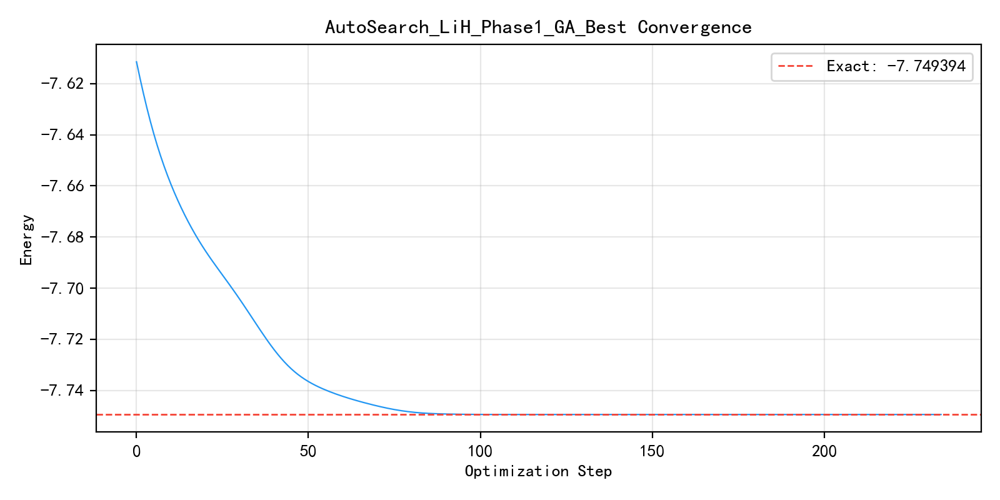
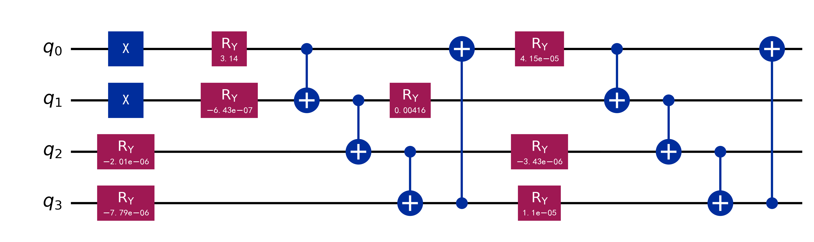

# 实验结题报告: AutoSearch_LiH_Phase1_GA_Best
- **日期**: 2026-03-11 13:12:03
- **后端**: TensorCircuit (PyTorch)

## 一、 核心指标
| 指标 | 数值 |
| :--- | :--- |
| **最终能量** | -7.74939394 |
| **精确能量** | -7.74939369 |
| **能量误差** | 2.45447191e-07 |
| **参数量** | 8 |
| **实际步数** | 235 |
| **耗时** | 4.21 s |
| **状态** | 完美收敛 (高精度) |

## 二、 收敛曲线

## 三、 线路可视化图示

## 四、 结果分析
GA Best: layers=2, single_qubit_gates=ry, two_qubit_gate=cnot, entanglement=ring, init_state=hf

### 精度评价
当前结果已进入化学精度范围。

## 五、 审计信息
- **配置路径**: `N/A`
- **代码版本**: `e88b5f9a`
- **环境指纹**: `Python 3.12.12`

---
*完整实验数据（包括线路 JSON 与图像）已保存至目录下。*
