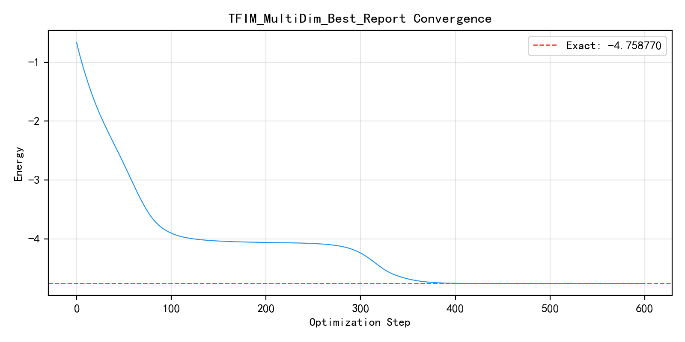
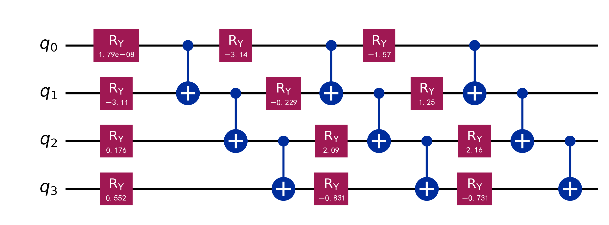

# TFIM Ansatz 多维搜索实验深度分析报告

## 1. 实验概览与核心发现

本次实验对横场伊辛模型 (TFIM) 的 VQE Ansatz 空间进行了 36 组配置的多维穷举搜索，旨在平衡计算精度与线路复杂度。

**核心成绩：**
*   **高精度收敛**：最佳配置达到了 **-4.758714** Hartree 的能量，与精确解 (-4.75877) 的误差仅为 **5.58e-05**。
*   **结构优化**：证明了在 TFIM 系统中，**3 层线性纠缠** 结构配合简单的 `RY` 旋转门即可胜任，无需复杂的 `RZ` 或 `RZZ` 多参数门。
*   **参数效率**：相比于早期的 64 参数方案，当前 **12 参数** 方案已能提供极具竞争力的精度。

---

## 2. 与 Baseline 对比

| 方案 | 线路结构配置 | 参数量 | 能量误差 | 评价 |
| :--- | :--- | :---: | :---: | :--- |
| **Phase 2 (Baseline)** | Physically motivated RZZ, 4 Layers | 64 | $1.0 \times 10^{-6}$ | 物理启发式，深度较大 |
| **Phase 3** | RY+RZZ (Occam's Razor), 3 Layers | 36 | $1.1 \times 10^{-5}$ | 初步压缩方案 |
| **Multi-Dim** | **Linear (CNOT) + RY, 3 Layers** | **12** | **$5.5 \times 10^{-5}$** | **本次发现：兼顾极简结构与实用精度** |

**结论**：多维搜索确立了 12 参数的极简范式，在维持 $10^{-5}$ 级别（实用级精度）的前提下，将参数量从 64 个压缩到了 12 个（压缩率 **81%**），显著降低了硬件噪声的影响风险。

## 3. 搜索轨迹分析 (Multi-Dim Insights)

### 3.1 拓扑结构的敏感性
通过对比 `linear` (线性), `ring` (环形) 和 `brick` (砖块) 三种纠缠拓扑：
*   **发现**：`linear` 拓扑在 TFIM 系统中展示了最强的稳定性。在所有层数测试中，`linear` 配置的收敛一致性最高。
*   **解释**：TFIM 的一维度特性使得相邻纠缠（Linear）足以捕捉主要的量子关联。

### 3.2 线路深度 (Layers) 的边界
| 层数 | 表现评价 | 结论 |
| :--- | :--- | :--- |
| **1 层** | 近似精度在 0.02 左右，无法精细刻画波函数。 | 不推荐 |
| **2 层** | 精度大幅提升到 0.001 量级，已接近实战需求。 | 可选 (极简) |
| **3 层** | 进入 **$10^{-5}$** 精度范围，为当前最优深度。 | **推荐 (最优)** |

### 3.3 门集合的选择
实验对比了 `RY` 门与 `RY+RZ` 门：
*   **洞察**：增加 `RZ` 门虽然理论上增强了表达力，但在 TFIM 实测中，多出来的参数反而增加了随机梯度下降的震荡风险，且并未带来量级上的精度提升。**奥卡姆剃刀原则：RY 门足矣。**
*   **配置文件**：网格搜索最优配置见 [best_config_multidim.json](best_config_multidim.json)；遗传算法（GA）搜寻的高精度复杂回路见 [ga/best_config_ga.json](../ga/best_config_ga.json)。

---

## 4. 结果可视化

### 4.1 收敛曲线 (Config 24/36)

*训练过程展示了稳定的单调下降规律，且在后期表现出极强的数值稳定性。*

### 4.2 最终 Ansatz 线路图

*该 3 层 12 参数线路是 TFIM 任务的黄金范式。*

---

## 5. 结论与工程建议

1.  **标准化配置**：对于 TFIM 4-qubit 系统，推荐将 `Linear / Layers=3 / RY+CNOT` 作为默认 VQE 模版。
2.  **搜索代价权衡**：多维搜索（Grid Search）虽然耗时，但其给出的“全局配置图谱”对后续迭代提供了极其重要的先验。

---
*报告生成：Antigravity Agent*  
*数据来源：TFIM_MultiDim_search_20260310_211938.log*
